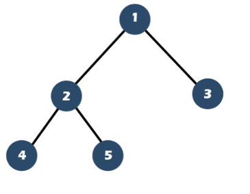
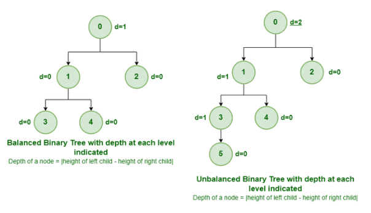
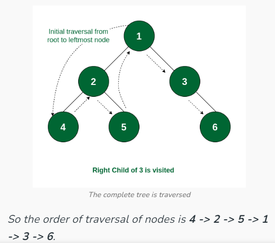
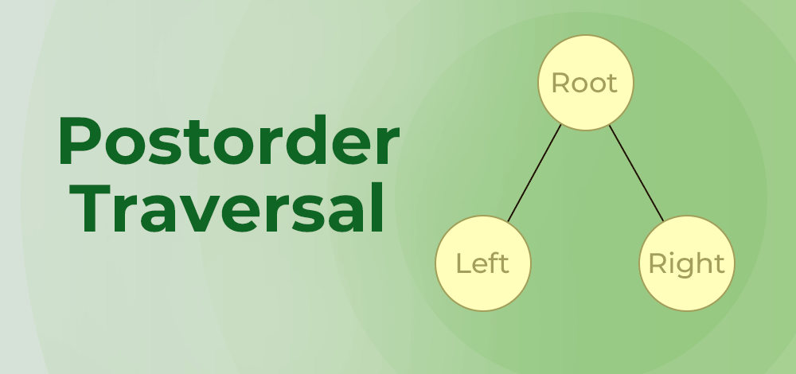
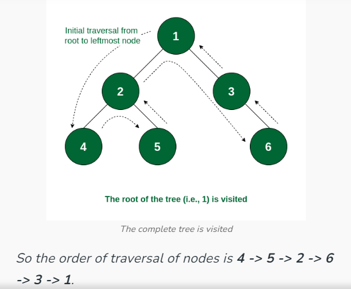

##  Chapter - Tree

# What is Tree Data Structure?
Tree data structure is a hierarchical structure that is used to represent and organize data in a way that is easy to navigate and search. It is a collection of nodes that are connected by edges and has a hierarchical relationship between the nodes. 

# Why Tree is considered a non-linear data structure?
The data in a tree are not stored in a sequential manner i.e., they are not stored linearly. Instead, they are arranged on multiple levels or we can say it is a hierarchical structure. For this reason, the tree is considered to be a non-linear data structure.

# Following are the different Basic Terminology based on the
parent node:

child node :

Root Node :

Leaft Node :

Ancestor of a Node :

Descendant of a node :

Sibling:

Level of a node:

Internal node:

Neighbour of a Node:

Subtree: 

## Different Types of Tree

Full Binary Tree = A tree in which every node has either 0 or 2 children.

Complete Binary Tree = All the levels are completely filled except the last level and the last level has all the nodes 'n' on the left side as possible.

Perfect Binary Tree = It say all the leaves have the same depth or same level.
 

Balance Binary Tree = A binary tree is balanced if the height of the tree is O(Log n) where n is the number of nodes
or we can say , A balanced binary tree is a binary tree that follows the 3 conditions:
    a) The height of the left and right tree for any node does not differ by more than 1.
    b) The left subtree of that node is also balanced.
    c) The right subtree of that node is also balanced.
    Note:- A single node is always balanced. It is also referred to as a height-balanced binary tree.

Degenerate Binary Tree = A degenerate tree is a binary tree in data structure in which each parent node has only one child node associated with it.
.

## Different ategory to traverse on tree -> [DFS AND BFS]
There are two way to traverse the tree 
1. Depth First Traversal: DFS is the most common way, and it is performed by traversing to the leaf nodes. It goes as deep as it can and then moves on to the next branch. DFS is implemented using a stack or recursion.

Following are the three different technique that are help for dfs traversal:

In-order traversal: Left + Root + Right

example: 

Pre-order Traversal: Root + Left + Right

example:

Post-order Traversal: Left + Right + Root

example:

2. Breadth First Traversal: BFS is a traversal technique in which all the nodes of the same level are explored first, and then we move to the next level.  BFS is implemented using a queue or recursion.
