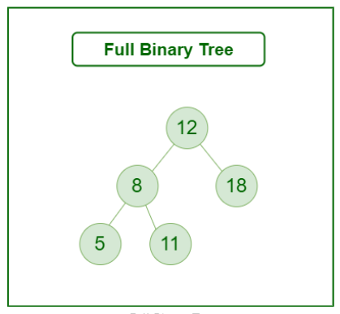

##  Chapter - Tree

# What is Tree Data Structure?
Tree data structure is a hierarchical structure that is used to represent and organize data in a way that is easy to navigate and search. It is a collection of nodes that are connected by edges and has a hierarchical relationship between the nodes. 

# Why Tree is considered a non-linear data structure?
The data in a tree are not stored in a sequential manner i.e., they are not stored linearly. Instead, they are arranged on multiple levels or we can say it is a hierarchical structure. For this reason, the tree is considered to be a non-linear data structure.

# Following are the different Basic Terminology based on the
parent node:

child node :

Root Node :

Leaft Node :

Ancestor of a Node :

Descendant of a node :

Sibling:

Level of a node:

Internal node:

Neighbour of a Node:

Subtree: 

## Different Types of Tree

# Full Binary Tree 
A tree in which every node has either 0 or 2 children.
